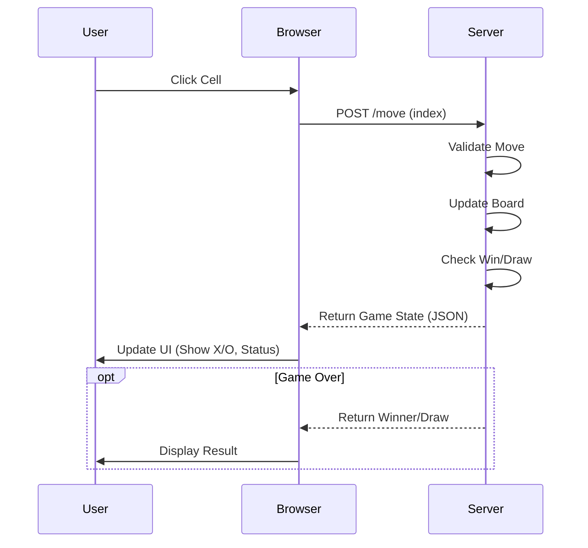

# Tic Tac Toe Web Application

A simple Tic Tac Toe game built with Python (Flask) and vanilla HTML/CSS/JS.

## Features
- Classic Tic Tac Toe gameplay
- Clean and responsive UI
- **Secure Session-based State**: Each player has their own game instance.
- **Security Headers**: Protected by Flask-Talisman (CSP, HSTS).
- **Containerized**: Ready for deployment with Docker.
- **CI/CD**: Automated testing and linting via GitHub Actions.

## Prerequisites
- Python 3.9+
- pip
- Docker (optional)

## Installation

1. Clone the repository (if applicable) or navigate to the project directory.
2. Install the required dependencies:
   ```bash
   pip install -r requirements.txt
   ```

## Usage

### Local Development
1. Start the Flask server:
   ```bash
   python3 app.py
   ```
2. Open your web browser and navigate to:
   ```
   http://127.0.0.1:5000
   ```

### Docker
1. Build the image:
   ```bash
   docker build -t tictactoe .
   ```
2. Run the container:
   ```bash
   docker run -p 5000:5000 tictactoe
   ```

## Security
- **Secret Key**: The app uses a secret key for session signing. In production, set the `SECRET_KEY` environment variable.
- **Headers**: Content Security Policy and other headers are enforced.

## Testing

To run the test suite:
```bash
pytest tests/test_app.py
```

## Project Structure
- `app.py`: Main Flask application and game logic.
- `templates/index.html`: Game interface.
- `static/style.css`: Styles.
- `static/script.js`: Frontend logic.
- `tests/test_app.py`: Unit and integration tests.

## Architecture

```mermaid
graph TD
    Client[Browser (HTML/JS)] <-->|HTTP Requests (JSON)| Server[Flask Server (Python)]
    Server <-->|Read/Write| State[Game State (Memory)]
    
    subgraph Frontend
        Client
    end
    
    subgraph Backend
        Server
        State
    end
```

## Game Flow

